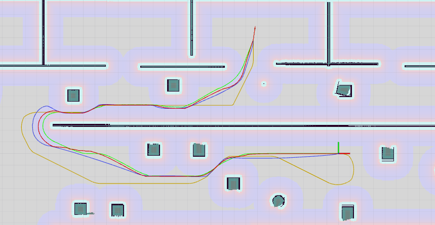
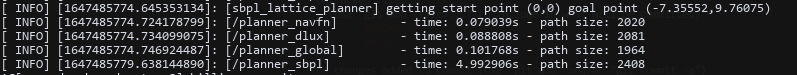

# ROS Global planner benchmark

Using for evaluate global planner

### usage

    roslaunch planner_benchmark benchmark.launch

- Set robot pose: Using "2D Pose Estimate" tool of Rviz
- Set goal: Using "2D Nav goal"

Add more planner by create new node in benchmark.lauch and config in param

### Result

Path

Time

